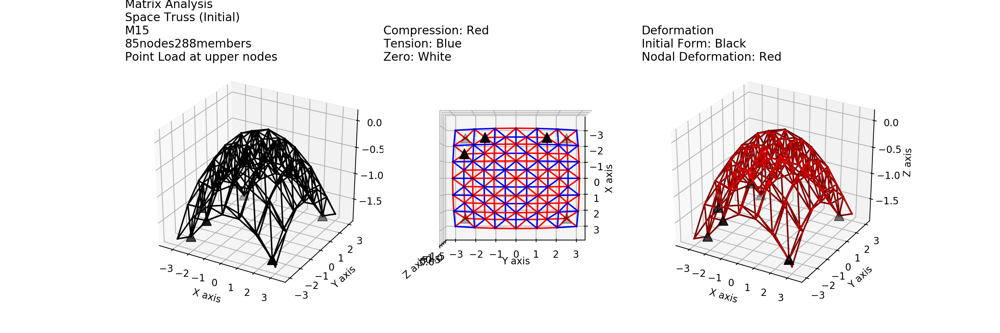

# Parametric-Truss-Analysis
Create a truss with parametric function and analyze it with Matrix Analysis

What the project does?

This is the Program to create a truss structure with parametric function and calculate it using Matrix Analysis Method. By giving input data , the program will create a truss structure, form the structure stiffness matrix and calculate deformations of the structure.

Why the project is useful?

This repository is an extension from https://github.com/kupc25648/Truss-Analysis. If you are someone who is trying to program your own structural analysis and design program, I hope this repository can helps.

How users can get started with the project?

The repository includes 3 parts

Input.py
Analysis.py
render.py
Users can create input data in "Analysis.py" and output data will be given with a render.

Where users can get help with your project?

Please feel free to contact me at kupc25648@hotmail.com

Example

